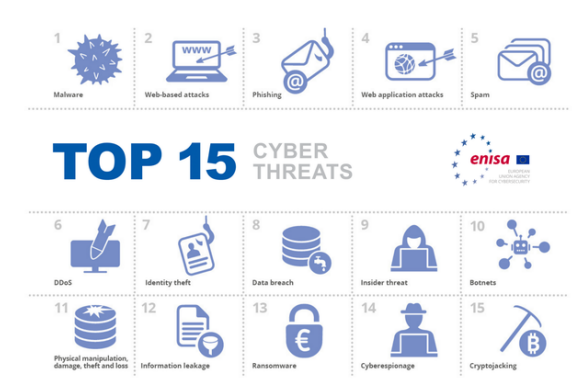
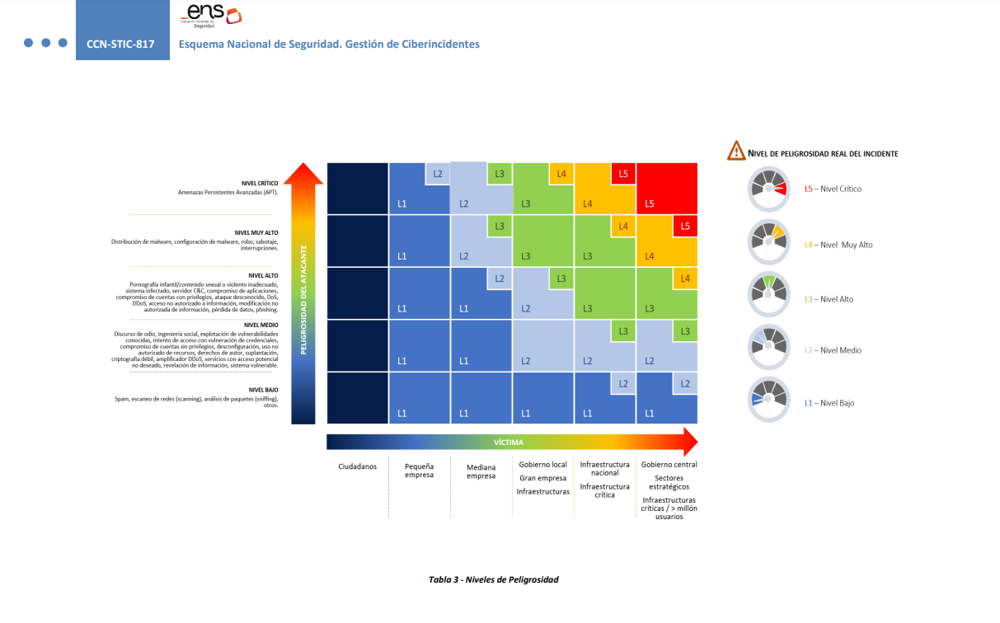

# M1877 - Seguridad en Cloud Computing.
# José Enrique Rodríguez González.
# PEC4: Aspectos legales del Cloud Computing: una visión global

## Indice

- [Presentación.](#presentación)
- [Pregunta 1.](#pregunta-1)
- [Pregunta 2.](#pregunta-2)
- [Pregunta 3.](#pregunta-3)
- [Pregunta 4.](#pregunta-4)
- [Respuesta a la pregunta 1.](#respuesta-a-la-pregunta-1)
- [Respuesta a la pregunta 2.1.](#respuesta-a-la-pregunta-21)
- [Respuesta a la pregunta 2.2.](#respuesta-a-la-pregunta-22)
- [Respuesta a la pregunta 3.1.](#respuesta-a-la-pregunta-31)
- [Respuesta a la pregunta 3.2.](#respuesta-a-la-pregunta-32)
- [Respuesta a la pregunta 3.3.](#respuesta-a-la-pregunta-33)
- [Respuesta a la pregunta 4.1.](#respuesta-a-la-pregunta-41)
- [Respuesta a la pregunta 4.2.](#respuesta-a-la-pregunta-42)

---

## Presentación

Esta PEC trata sobre los aspectos legales del Cloud Computing y del marco normativo y otros estándares nacionales e internacionales que aplican a políticas de seguridad en entornos cloud y a la gestión de la información vinculada a ciberdelitos.

Para cualquier duda y/o aclaración sobre el enunciado, debéis dirigiros al consultor responsable de vuestra aula.

[Volver al índice.](#indice)

---

<br><br><br><br><br><br><br><br><br>

##  Pregunta 1.

Como habrás observado en el módulo de teoría, el marco normativo se encuentra dentro del Código de Derecho de la Ciberseguridad donde se agrupan las diferentes leyes y decretos aplicables a los delitos informáticos.

Realiza un cuadro comparativo de las diferentes leyes vistas en el módulo de teoría dependiendo de a quién aplica (empresa pública, empresa privada, proveedor de servicios, a las personas, etc.).

Justifica tu respuesta.

[Volver al índice.](#indice)

---

## Pregunta 2.

La empresa BEST CLOUD S.L. presta servicios a una universidad pública en España. Uno de los servicios contratados consta de un portal web donde estudiantes con necesidades especiales pueden realizar peticiones a la universidad para que se les presten las ayudas necesarias dentro de esta. Cada estudiante que lo necesita dispone de un portal donde se almacenan sus datos personales (nombre, apellido, dni, asignaturas, discapacidad y otros datos de salud) de forma que la universidad pueda ofrecerles un mejor servicio.

Por algún motivo que se desconoce uno de los  estudiantes que tiene acceso a la plataforma, una vez se ha autenticado con su usuario y contraseña, se da cuenta que los datos que aparecen no son los suyos sino que corresponden a otro estudiante y se da cuenta que puede ver todos sus datos.

1. Identifica qué infracciones se han producido en materia de protección de datos. Justifica tu respuesta.

2. ¿Quién o quiénes serían los responsables de las infracciones cometidas?

[Volver al índice.](#indice)

---

<br><br><br><br><br><br><br><br><br><br><br><br><br><br><br>

## Pregunta 3.

En los últimos años hemos visto cómo va creciendo la cantidad de delitos informáticos, algunos más mediáticos y otros menos. El objetivo de este ejercicio es conocer diferentes tipos de delitos y qué leyes se aplican a cada uno. Se tienen que justificar las respuestas.

Para la realización de este ejercicio te tienes que guiar por el top 15 sobre ataques informáticos presentado por ENISA:



1. Busca dos delitos informáticos diferentes y analiza qué leyes, de las que aparecen en el módulo de teoría, aplicarían en cada uno de ellos.

2. De los dos delitos buscados en el apartado anterior, relaciónalos con los tipos de delitos que aparecen en el módulo de teoría e identifica qué intenciones tenía el atacante.

3. ¿A quién corresponde la responsabilidad civil en los delitos anteriores?

4. Según los criterios del Esquema Nacional de Seguridad, ¿qué clasificación de riesgo tendrían los delitos comentados en los apartados anteriores?

[Volver al índice.](#indice)

---

<br><br><br><br><br><br><br>

## Pregunta 4.

En la primera PEC ya se utilizó la herramienta *Cloud Control Matrix (CCM)* para el control de la seguridad en cloud computing alineada con el conjunto de buenas prácticas que nos ofrece el *Cloud Security Alliance (CSA)*. Para este ejercicio lo que se pide es ver como se puede adaptar algunos de los dominios descritos en la herramienta *CCM* versión 4.0 al *Esquema Nacional de Seguridad (ENS)*.

Para la realización del ejercicio tienes disponible en la web del *CCN-CERT* el *ENS* consultable de forma más cómoda que su publicación en el BOE. Concretamente te tienes que fijar en el **Anexo II Medidas de seguridad: Apartado 2 Selección de medidas de seguridad**:

<https://ens.ccn.cni.es/ens-html/index.html>

1. Completa la siguiente tabla seleccionando las medidas de seguridad adecuadas de las que se describen en el *ENS* para poder cumplir los siguientes controles:

|**Control**|**Medidas de seguridad**|**Nivel que aplica**|
| - | - | - |
|AIS-01|mp.sw.1|Mig|
|AIS-04|||
|IAM-04|||
|IAM-05|||
|IVS-07|||
|IVS-09|||
|TVM-07|||
**NOTA: Se puede aplicar más de una medida de seguridad en cada control.**

2. El RD 311/2022 que regula el nuevo Esquema Nacional de Seguridad (ENS), incluye nuevas medidas específicas sobre la seguridad en servicios desplegados en la nube. Comenta brevemente estas nuevas medidas indicando a qué nivel aplica cada una.

[Volver al índice.](#indice)

---

<br><br><br><br><br><br><br><br><br><br><br>

## Respuesta a la pregunta 1.

Para responder adecuadamente voy a realizar una tabla con la ley, ámbito de aplicación y justificación de la misma.


| **Ley/Reglamento** | **Ámbito de aplicación** | **Justificación** |
| ------------------ | ------------------------ | ----------------- |
| Carta de Naciones Unidas	 | Todos los Estados miembros de las ONU	 | Reconoce el principio de no hacer uso de la fuerza en las relaciones internacionales. |
| Convenio de Budapest sobre ciberdelincuencia (2004)	 | Todos los Estados miembros firmantes del convenio.	 | Armoniza leyes para perseguir los delitos informáticos. |
| Estrategia de ciberseguridad EU (2013)	 | Estados miembros de la UE	 | Promueve los principios de ciberseguridad según los valores de la UE. |
| Ley 36/2015 de Seguridad Nacional | Sector público en España | Establece el marco de la ciberseguridad como un área de interés especial. |
| Ley 9/1968 de Secretos Oficiales | Sector público	en España | Regula la protección de la información reservada. |
| Ley 1/2019 de Secretos Empresariales | Sector privado	en España | Regula la protección de la información empresarial confidencial y estratégica. |
| Ley 8/2011 de Protección de Infraestructuras Críticas  | Entidades con infraestructuras críticas en España | Regula los ataques cibernéticos a infraestructuras críticas. |
| Reales decretos 12/2018 y 43/2021 | Servicios esenciales y estratégicos, servicios digitales	en España | Garantiza un elevado nivel de seguridad de las redes y sistemas de información. |
| Ley 9/2014 General de Telecomunicaciones y Ley 25/2007 | Operadores de redes públicas de comunicaciones en España | Regula el secreto de las comunicaciones y la cooperación con las autoridades en la investigación. |
| Ley 34/2002 LSSI | Prestadores de servicios de la sociedad de la información	en España | Regula la responsabilidad de los proveedores de servicios, la colaboración con las autoridades y los CSIRT. |
| Real Decreto 3/2010. ENS | Administraciones públicas y empresas que les prestan servicios	en España | Establece los principios básicos y requisitos mínimos para la protección de la información. |
| Reglamento (UE) 2016/679 (RGPD), y Ley Orgánica 3/2018 LOPDGDD | Cualquier entidad que maneje datos personales de ciudadanos de la UE en La Union europea para el Reglamento (UE) 2016/679 y en España para la LO 3/2018 | Regula la protección de datos personales y garantiza los derechos digitales. |
| | | |

[Volver al índice.](#indice)

---

<br><br><br><br><br><br><br><br><br><br><br><br><br><br><br><br><br><br><br><br><br><br><br><br><br><br><br><br><br><br><br>

## Respuesta a la pregunta 2.1.

En el caso que nos atañe en el presente ejercicio, cabe destacar que han podido ocurrir varias infracciones de acuerdo con el Reglamento General de Protección de Datos (RGPD) de la UE y de la Ley Orgánica de Protección de Datos y Garantía de los Derechos Digitales (LOPDGDD).

- **Incumplimiento del principio de minimización de datos**
  - Según el Artículo 5.1.c del RGPD , *"Los datos personales serán adecuados, pertinentes y limitados a lo necesario en relación con los fines para los que son tratados («minimización de datos»)"*. los datos personales deben ser "adecuados, pertinentes y limitados a lo necesario en relación con los fines para los que son procesados".
  - Si un estudiante puede acceder a todos los datos de otro estudiante, es posible que se estén procesando más datos de los necesarios.

- **Violación de la confidencialidad:**
  - Según el Artículo 5.1.f del RGPD, *"Los datos personales serán tratados de tal manera que se garantice una seguridad adecuada de los datos personales, incluida la protección contra el tratamiento no autorizado o ilícito y contra su pérdida, destrucción o daño accidental, mediante la aplicación de medidas técnicas u organizativas apropiadas («integridad y confidencialidad»)."*
  - En este caso, el hecho de que un estudiante pueda ver los datos de otro estudiante significa que se ha violado este principio de confidencialidad.

- **Violación de los derechos del interesado:**
  - Según el Artículo 15 del RGPD.
    1. *El interesado tendrá derecho a obtener del responsable del tratamiento confirmación de si se están tratando o no datos personales que le conciernen y, en tal caso, derecho de acceso a los datos personales y a la siguiente información:*  
      *a) los fines del tratamiento;*  
      *b) las categorías de datos personales de que se trate;*  
      *c) los destinatarios o las categorías de destinatarios a los que se comunicaron o serán comunicados los datos personales, en particular destinatarios en terceros u organizaciones internacionales;*  
      *d) de ser posible, el plazo previsto de conservación de los datos personales o, de no ser posible, los criterios utilizados para determinar este plazo;*  
      *e) la existencia del derecho a solicitar del responsable la rectificación o supresión de datos personales o la limitación del tratamiento de datos personales relativos al interesado, o a oponerse a dicho tratamiento;*  
      *f) el derecho a presentar una reclamación ante una autoridad de control;*  
      *g) cuando los datos personales no se hayan obtenido del interesado, cualquier información disponible sobre su origen;*  
      *h) la existencia de decisiones automatizadas, incluida la elaboración de perfiles, a que se refiere el artículo 22, apartados 1 y 4, y, al menos en tales casos, información significativa sobre la lógica aplicada, así como la importancia y las consecuencias previstas de dicho tratamiento para el interesado.*  
    2. *Cuando se transfieran datos personales a un tercer país o a una organización internacional, el interesado tendrá derecho a ser informado de las garantías adecuadas en virtud del artículo 46 relativas a la transferencia.*  
    3. *El responsable del tratamiento facilitará una copia de los datos personales objeto de tratamiento. El responsable podrá percibir por cualquier otra copia solicitada por el interesado un canon razonable basado en los costes administrativos. Cuando el interesado presente la solicitud por medios electrónicos, y a menos que este solicite que se facilite de otro modo, la información se facilitará en un formato electrónico de uso común.*  
    4. *El derecho a obtener copia mencionado en el apartado 3 no afectará negativamente a los derechos y libertades de otros.*  
  - Los sujetos de los datos tienen derecho a obtener confirmación de si se están procesando o no sus datos personales, y si es así, acceso a los datos personales.
  - La capacidad de un estudiante para ver los datos de otro estudiante infringe este derecho.

- **Incumplimiento del principio de integridad y confidencialidad:**
  - De acuerdo con el artículo 32 del RGPD, que dice:
    1. *Teniendo en cuenta el estado de la técnica, los costes de aplicación, y la naturaleza, el alcance, el contexto y los fines del tratamiento, así como riesgos de probabilidad y gravedad variables para los derechos y libertades de las personas físicas, el responsable y el encargado del tratamiento aplicarán medidas técnicas y organizativas apropiadas para garantizar un nivel de seguridad adecuado al riesgo, que en su caso incluya, entre otros:*  
      *a) la pseudo-anonimización y el cifrado de datos personales;*  
      *b) la capacidad de garantizar la confidencialidad, integridad, disponibilidad y resiliencia permanentes de los sistemas y servicios de tratamiento;*  
      *c) la capacidad de restaurar la disponibilidad y el acceso a los datos personales de forma rápida en caso de incidente físico o técnico;*  
      *d) un proceso de verificación, evaluación y valoración regulares de la eficacia de las medidas técnicas y organizativas para garantizar la seguridad del tratamiento.*  
    2. *Al evaluar la adecuación del nivel de seguridad se tendrán particularmente en cuenta los riesgos que presente el tratamiento de datos, en particular como consecuencia de la destrucción, pérdida o alteración accidental o ilícita de datos personales transmitidos, conservados o tratados de otra forma, o la comunicación o acceso no autorizados a dichos datos.*  
    3. *La adhesión a un código de conducta aprobado a tenor del artículo 40 o a un mecanismo de certificación aprobado a tenor del artículo 42 podrá servir de elemento para demostrar el cumplimiento de los requisitos establecidos en el apartado 1 del presente artículo.*  
    4. *El responsable y el encargado del tratamiento tomarán medidas para garantizar que cualquier persona que actúe bajo la autoridad del responsable o del encargado y tenga acceso a datos personales solo pueda tratar dichos datos siguiendo instrucciones del responsable, salvo que esté obligada a ello en virtud del Derecho de la Unión o de los Estados miembros.*  
  - El responsable del tratamiento el responsable del tratamiento de los datos debe implementar medidas técnicas y organizativas apropiadas para garantizar un nivel de seguridad adecuado al riesgo. Esto incluye la capacidad de garantizar la confidencialidad, integridad, disponibilidad y resistencia constante de los sistemas y servicios de tratamiento.

En España, estas infracciones se sancionarían de acuerdo con la LOPDGDD se califican de muy graves Tratamiento de datos personales que vulneren las garantías y principios establecidos en el artículo 5 del RGPD. En este caso nos atañe los dos primeros apartados.

El RGPD considera infracciones muy graves las vulneraciones de artículos de los derechos de los interesados, arts.: <u>**12 a 22**</u>. En este caso atañe al tercer apartado


Relativo al último apartado, cabe destacar que el RGPD considera infracciones graves vulnerar los siguientes artículos:
  - Obligaciones del responsable y del encargado, arts.: 8, 11, <u>**25 a 39**</u>, 42 y 43.

Destacar que el tipo de sanciones puede variar según los artículos que finalmente se dictaminen que sean vulnerados. pudiendo abarcar las siguientes cuantías.

1. Sanciones LOPDGDD:
  - Las sanciones LOPDGDD para infracciones muy graves: multa entre 300.001 euros a 20 millones de euros (o el 4% de la facturación anual (la cuantía que sea mayor)).

2. Sanciones RGPD:
  - Las sanciones que establece el RGPD son:
    - Para infracciones muy graves: multa de hasta 20 millones de euros (o el 4% de la facturación anual, aplicando la cuantía que resulte más alta).
    - Para infracciones graves: multa de hasta 10 millones de euros (o el 2% de la facturación anual, aplicando la cuantía que resulte más alta).

Relativo a este último apartado he usado esta página web como fuente de información bastante útil para la elaboración del presente apartado:
- [Protección de datos LOPD.com](https://protecciondatos-lopd.com/empresas/infracciones-sanciones-lopdgdd-rgpd/#Infracciones_LOPD_y_RGPD)

[Volver al índice.](#indice)

---

<br><br><br><br><br><br><br><br><br><br><br><br><br><br><br><br>

## Respuesta a la pregunta 2.2.

En el marco del Reglamento General de Protección de Datos (RGPD), los roles clave en el procesamiento de datos son los de controlador de datos y el procesador de datos.

**Controlador de datos:**
- Es la entidad que determina los propósitos y medios del procesamiento de datos personales. En este caso, la universidad pública sería probablemente el controlador de datos, ya que es la entidad que decide qué datos se recogen y cómo se utilizan.

**Procesador de datos:**
- Es la entidad que procesa los datos personales en nombre del controlador de datos. En este caso, BEST CLOUD S.L. podría ser considerada como el procesador de datos, ya que están proporcionando el portal web y realizando el procesamiento de los datos en nombre de la universidad.

Ambas partes tienen responsabilidades según el RGPD. El controlador de datos es en última instancia responsable de garantizar que el procesamiento cumple con el RGPD, pero el procesador de datos también tiene obligaciones, como garantizar la seguridad de los datos y seguir las instrucciones del controlador.

En el incidente que has descrito, la responsabilidad puede recaer en ambos, dependiendo de los detalles de su acuerdo y de cómo ocurrió la violación. Si la violación fue causada por una falla en las medidas de seguridad implementadas por BEST CLOUD S.L., entonces ellos podrían ser considerados responsables. Sin embargo, la universidad también tendría responsabilidad, ya que es su obligación garantizar que los terceros que contratan para procesar datos personales cumplen con el RGPD.

Como estamos en un pequeño ejercicio el cual es a fines didácticos, podemos considerar que ha podido ser un cruce en los login, dos usuarios en el mismo momento hacen una llamada al servidor de login, pudiéndose cruzar los datos entre sí y enviarle a usuario A el token de B y al usuario B el token de A. Si esta fuera el motivo del fallo, es por culpa del funcionamiento del software, es decir, del procesado de los datos. Por lo que en este caso, se podría atribuir el fallo a la empresa BEST CLOUD S.L., al ser un fallo puntual, se debe de reportar al procesador de datos para que traten de solventar el citado bug y posiblemente la universidad publica, no tuviera parte de culpa ya que ha sido, repito, un fallo puntual. Aun así, se deberían de revisar los protocolo de control por parte de la universidad.

Si este caso hubiera sido un caso real y no como en este supuesto didáctico, sería necesario un análisis más detallado y posiblemente la intervención de la autoridad supervisora de protección de datos para determinar con precisión quién sería considerado responsable en este escenario.

[Volver al índice.](#indice)

---

<br><br><br><br><br><br><br>

## Respuesta a la pregunta 3.1.


Para este ejercicio, elegiré dos tipos de delitos informáticos de la lista proporcionada por ENISA: el `Phishing` y `Ransomware`.

1. Phishing.
  - Este es un método de fraude en línea que involucra el envío de un correo electrónico que parece ser de una fuente legítima pero que, en realidad, es un intento de adquirir ilegalmente información personal, como nombres de usuario, contraseñas y detalles de tarjetas de crédito.
  - Relativo a las leyes aplicables en el estado español. Cabe destacar el articulo 248 del Código penal. En la web de [Conceptos Jurídicos 248 CP](https://www.conceptosjuridicos.com/codigo-penal-articulo-248/), encontramos lo siguiente:
    - *Cometen estafa los que, con ánimo de lucro, utilizaren engaño bastante para producir error en otro, induciéndolo a realizar un acto de disposición en perjuicio propio o ajeno.*
    - *Los reos de estafa serán castigados con la pena de prisión de seis meses a tres años. Para la fijación de la pena se tendrá en cuenta el importe de lo defraudado, el quebranto económico causado al perjudicado, las relaciones entre este y el defraudador, los medios empleados por este y cuantas otras circunstancias sirvan para valorar la gravedad de la infracción.*
    - *Si la cuantía de lo defraudado no excediere de 400 euros, se impondrá la pena de multa de uno a tres meses.*
    - Tras la actualización publicada el 23/12/2022, que entró en vigor el 12/01/2023, se modifica este artículo 248 por el art. 1.2 de la Ley Orgánica 14/2022, de 22 de diciembre. Anteriormente, decía lo siguiente:
      1. *Cometen estafa los que, con ánimo de lucro, utilizaren engaño bastante para producir error en otro, induciéndolo a realizar un acto de disposición en perjuicio propio o ajeno.*
      2. *También se consideran reos de estafa:*
        - <u>**Los que, con ánimo de lucro y valiéndose de alguna manipulación informática o artificio semejante, consigan una transferencia no consentida de cualquier activo patrimonial en perjuicio de otro.**</u>
        - *Los que fabricaren, introdujeren, poseyeren o facilitaren programas informáticos específicamente destinados a la comisión de las estafas previstas en este artículo.*
        - *Los que utilizando tarjetas de crédito o débito, o cheques de viaje, o los datos obrantes en cualquiera de ellos, realicen operaciones de cualquier clase en perjuicio de su titular o de un tercero.*

2. Ransomware.
  - Es un tipo de malware que cifra los archivos del usuario y, luego, exige un rescate a cambio de la clave para desbloquearlos. A menudo, el rescate se exige en una criptomoneda como Bitcoin para dificultar el seguimiento del pago.
  - Relativo a las leyes aplicables en el estado español. Usando la misma fuente que en el apartado anterior.
    - Cabe destacar el artículo 197 del Código penal.
      - [Conceptos Jurídicos 197 CP](https://www.conceptosjuridicos.com/codigo-penal-articulo-197/)
      - Sanciona la revelación de secretos y el descubrimiento y revelación de secretos de empresa.
    - Cabe destacar el artículo 264 del Código penal.
      - [Conceptos Jurídicos 264 CP](https://www.conceptosjuridicos.com/codigo-penal-articulo-264/)
      -  Castiga a aquellos que sin autorización y de manera consciente, borren, dañen, deterioren, alteren, supriman o inutilicen datos, programas informáticos o documentos electrónicos ajenos. En el caso de Ransomware, los datos se cifran, lo que se puede interpretar como alteración o daño.
  - Además, es importante mencionar nuevamente el Reglamento General de Protección de Datos (GDPR) de la Unión Europea. Si una empresa sufre un ataque de ransomware que resulta en una violación de datos personales, podría enfrentar sanciones bajo el GDPR si no ha tomado las medidas adecuadas para proteger los datos personales.


[Volver al índice.](#indice)

---

<br><br><br><br><br><br><br><br><br><br><br><br><br><br><br><br><br><br><br><br><br><br><br><br><br><br><br><br><br><br><br><br><br><br>

## Respuesta a la pregunta 3.2.

Se pueden relacionar tanto el Phishing como el del Ransomware con el Código Penal de la siguiente manera:

1. Descubrimiento de secretos o vulneración de la intimidad (197.1 y 197.2 CP): 

  - En el caso del phishing, si el atacante obtiene datos personales sin consentimiento, estaría cometiendo este delito.
  - [Conceptos Jurídicos 197 CP](https://www.conceptosjuridicos.com/codigo-penal-articulo-197/)

2. Intrusión informática (197.1 bis CP):
  - Tanto en el caso del phishing (si el atacante utiliza la información obtenida para acceder a un sistema sin autorización) como en el caso del ransomware (que requiere acceso al sistema para cifrar los archivos), estaríamos hablando de este delito.
  - [Conceptos Jurídicos 197-bis CP](https://www.conceptosjuridicos.com/codigo-penal-articulo-197-bis/)

3. Interceptación de las transmisiones de datos (197.2 bis CP): 
  - En el caso del phishing, si el atacante comparte los datos obtenidos con terceros, estaría cometiendo este delito. Además, en el caso del ransomware, si el atacante proporciona o vende el ransomware a otros, también se puede considerar cooperación.
  - [Conceptos Jurídicos 197-bis CP](https://www.conceptosjuridicos.com/codigo-penal-articulo-197-bis/)

4. Cooperación en la comisión del delito (197 ter CP):
  - En el caso del phishing, si el atacante comparte los datos obtenidos con terceros, estaría cometiendo este delito. Además, en el caso del ransomware, si el atacante proporciona o vende el ransomware a otros, también se puede considerar cooperación.
  - [Conceptos Jurídicos 197-ter CP](https://www.conceptosjuridicos.com/codigo-penal-articulo-197-ter/)

5. Fraudes informáticos (Capítulo VI de las defraudaciones, Sección I de las estafas Artículos 248 a 251 Bis. CP):
  - Tanto el phishing como el ransomware pueden llevar a la comisión de fraudes, ya que los atacantes pueden utilizar la información obtenida en el caso del phishing para hacer transferencias no consentidas o pueden exigir un rescate en el caso del ransomware.
  Cooperación en la comisión del delito (197 ter CP): En el caso del phishing, si el atacante comparte los datos obtenidos con terceros, estaría cometiendo este delito. Además, en el caso del ransomware, si el atacante proporciona o vende el ransomware a otros, también se puede considerar cooperación.
  - [Conceptos Jurídicos 249 CP](https://www.conceptosjuridicos.com/codigo-penal-articulo-249/)
  - [Conceptos Jurídicos 250 CP](https://www.conceptosjuridicos.com/codigo-penal-articulo-250/)
  - [Conceptos Jurídicos 251 CP](https://www.conceptosjuridicos.com/codigo-penal-articulo-251/)
  - [Conceptos Jurídicos 251-bis CP](https://www.conceptosjuridicos.com/codigo-penal-articulo-251-bis/)

6. Sabotaje informático (Título XIII: Delitos contra el patrimonio y contra el orden socioeconómico, Capítulo IX: De los daños, artículos 263 a 267. CP):
  - El ransomware se podría considerar un caso de sabotaje informático, ya que altera los archivos del usuario y los hace inaccesibles.
  - [Conceptos Jurídicos 263 CP](https://www.conceptosjuridicos.com/codigo-penal-articulo-263/)
  - [Conceptos Jurídicos 264 CP](https://www.conceptosjuridicos.com/codigo-penal-articulo-264/)
  - [Conceptos Jurídicos 264-bis CP](https://www.conceptosjuridicos.com/codigo-penal-articulo-264-bis/)
  - [Conceptos Jurídicos 264-ter CP](https://www.conceptosjuridicos.com/codigo-penal-articulo-264-ter/)
  - [Conceptos Jurídicos 264-quater CP](https://www.conceptosjuridicos.com/codigo-penal-articulo-264-quater/)
  - [Conceptos Jurídicos 265 CP](https://www.conceptosjuridicos.com/codigo-penal-articulo-265/)
  - [Conceptos Jurídicos 266 CP](https://www.conceptosjuridicos.com/codigo-penal-articulo-266/)
  - [Conceptos Jurídicos 267 CP](https://www.conceptosjuridicos.com/codigo-penal-articulo-267/)

[Volver al índice.](#indice)

---

## Respuesta a la pregunta 3.3.

La responsabilidad civil en los delitos se refiere a la obligación de indemnizar o reparar el daño causado por el delito. En el marco del Código Penal español, la responsabilidad civil recae generalmente en el autor o autores del delito. Esto significa que la persona que cometió el delito informático (phishing, ransomware, etc.) sería responsable de compensar a la víctima por los daños y perjuicios sufridos.

Además, pueden existir circunstancias en las que otras partes puedan ser consideradas responsables civilmente. Por ejemplo, si una empresa no ha mantenido medidas de seguridad adecuadas y esto facilitó la comisión del delito, es posible que se pueda argumentar que la empresa tiene una cierta responsabilidad civil.

Es importante señalar que la determinación de la responsabilidad civil en casos concretos puede ser muy compleja y depende de las circunstancias específicas de cada caso. En general, la responsabilidad civil se determina en un proceso judicial y puede requerir la intervención de expertos legales y técnicos.

[Volver al índice.](#indice)

---

<br><br><br><br><br><br><br><br><br><br><br><br><br><br><br><br><br><br>

## Respuesta a la pregunta 3.4.

Para responder a la presente pregunta, es importante observar la CCN-STIC 817



En el podemos ver que el phishing tiene un nivel de peligrosidad alto (lo pone claramente la imagen), sin embargo, para Ransomware, hay que tomarlo como un robo o sabotaje. por lo que el nivel de peligrosidad de este tipo de ataques es muy alto.

Por otro lado hay que analizar el tipo de victima a la que ha sido realizado el ataque, en el marco del ENS no se determina únicamente en función de la amenaza, sino también en función de la sensibilidad y el valor de la información que se maneja en el sistema de información. Por tanto, la clasificación de riesgo final dependerá del análisis de riesgos que se realice considerando las particularidades de cada caso.

[Volver al índice.](#indice)

---

<br><br><br><br><br><br><br><br><br><br><br>

## Respuesta a la pregunta 4.1.

|**Control**|**Medidas de seguridad**|**Nivel que aplica**|
| - | - | - |
|AIS-01: Application and Interface Security Policy and Procedures |mp.sw.1: Desarrollo de aplicaciones	|MEdio|
|AIS-04: Secure Application Design and Development|mp.sw.1: Desarrollo de aplicaciones	|Medio|
|IAM-04: Separation of Duties|mp.per.2: Deberes y obligaciones	|Medio|
|IAM-05: Least Privilege|mp.if.2: Identificación de las personas, mp.sw.1: Desarrollo de aplicaciones	|Medio|
|IVS-07: Migration to Cloud Environments|mp.s.2: Protección de servicios y aplicaciones web, mp.com.1: Perímetro seguro, mp.sw.1: Desarrollo de aplicaciones|Alto|
|IVS-09: Network Defense|mp.com.1: Perímetro seguro, mp.eq.4: Otros dispositivos conectados a la red	|Alto|
|TVM-07: Vulnerability Identification|mp.com.3: Protección de la integridad y de la autenticidad, mp.sw.1: Desarrollo de aplicacione|Alto|


[Volver al índice.](#indice)

---

<br><br><br><br><br><br><br><br><br><br><br><br><br><br><br><br><br><br><br>

## Respuesta a la pregunta 4.2.


En el siguiente enlace se puede tener acceso al [RD 311/2022](https://www.boe.es/eli/es/rd/2022/05/03/311/con) de 3 de mayo, por el que se regula el Esquema Nacional de Seguridad.

Adentrándonos en el documento podemos ver  ma medida `op.nub.1` de proteccion de servicios en la nube. dentro de este documento, detalla las acciones a realizar y sus requisitos que a continuacion cito:

```
 Requisitos.

- [op.nub.1.1] Los sistemas que suministran un servicio en la nube a organismos del sector público deberán cumplir con el conjunto de medidas de seguridad en función del modelo de servicio en la nube que presten: Software como Servicio (Software as a Service, SaaS), Plataforma como Servicio (Platform as a Service, PaaS) e Infraestructura como Servicio (Infrastructure as a Service, IaaS) definidas en las guías CCN-STIC que sean de aplicación.

- [op.nub.1.2] Cuando se utilicen servicios en la nube suministrados por terceros, los sistemas de información que los soportan deberán ser conformes con el ENS o cumplir con las medidas desarrolladas en una guía CCN-STIC que incluirá, entre otros, requisitos relativos a:

a) Auditoría de pruebas de penetración (pentesting).

b) Transparencia.

c) Cifrado y gestión de claves.

d) Jurisdicción de los datos.

Refuerzo R1- Servicios certificados.

- [op.nub.1.r1.1] Cuando se utilicen servicios en la nube suministrados por terceros, estos deberán estar certificados bajo una metodología de certificación reconocida por el Organismo de Certificación del Esquema Nacional de Evaluación y Certificación de Seguridad de las Tecnologías de la Información.

- [op.nub.1.r1.2] Si el servicio en la nube es un servicio de seguridad deberá cumplir con los requisitos establecidos en [op.pl.5].

Refuerzo R2-Guías de Configuración de Seguridad Específicas.

- [op.nub.1.r2.1] La configuración de seguridad de los sistemas que proporcionan estos servicios deberá realizarse según la correspondiente guía CCN-STIC de Configuración de Seguridad Específica, orientadas tanto al usuario como al proveedor.

Aplicación de la medida.

- Categoría BÁSICA: op.nub.1.

- Categoría MEDIA: op.nub.1 + R1.

- Categoría ALTA: op.nub.1+ R1 + R2.
```

Una vez analizado el texto porporcionado se llega a las siguientes conclusiones relativo al propósito del apartado del ejercicio.

1. Requisitos Generales:
- Los sistemas que proporcionan servicios en la nube al sector público deben cumplir con un conjunto de medidas de seguridad, específicas al tipo de servicio en la nube que están suministrando (op.nub.1.1). Cuando estos servicios son proporcionados por terceros, deben cumplir con el Esquema Nacional de Seguridad (ENS) o seguir las guías CCN-STIC que incluyen requisitos para la auditoría de pruebas de penetración, transparencia, cifrado y gestión de claves, y la jurisdicción de los datos (op.nub.1.2).

2. Refuerzo R1- Servicios Certificados:
- Si los servicios en la nube son proporcionados por terceros, deben estar certificados por una metodología reconocida por el Organismo de Certificación del Esquema Nacional de Evaluación y Certificación de Seguridad de las Tecnologías de la Información (op.nub.1.r1.1). Si el servicio en la nube es un servicio de seguridad, debe cumplir con requisitos adicionales especificados en la sección [op.pl.5] (op.nub.1.r1.2).

3. Refuerzo R2 - Guías de Configuración de Seguridad Específicas:
- La configuración de seguridad de los sistemas que proporcionan estos servicios debe seguir la correspondiente guía CCN-STIC de Configuración de Seguridad Específica (op.nub.1.r2.1).

4. Aplicación de la Medida:
- Dependiendo del nivel de seguridad (BÁSICA, MEDIA, ALTA), se aplican diferentes combinaciones de medidas. Para la categoría BÁSICA, se aplica la medida general op.nub.1. Para la categoría MEDIA, se añade el refuerzo R1 a la medida general. Para la categoría ALTA, se aplican las medidas generales, R1 y R2.


[Volver al índice.](#indice)

---
